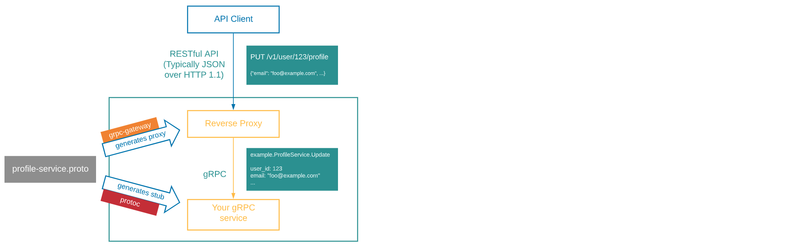

# GRPC, Meeting #4

## Notes from the meeting

* ~~What gRPC is and why/how it is used~~ // Covered: meeting #1

* Ecosystem/Tools/Implementation/Standards

  * ~~gRPC communication with protobuf encoding~~ // Covered: meeting #1

  * ~~Creating protobuf message and service definitions~~ // Covered: meeting #1

  * ~~Updating, versioning and maintaining backwards compatibility~~ // Covered: meeting #1

  * ~~Compiling the protobuf into client/server stubs~~ // Covered: meeting #1

  * ~~gRPC server reflection~~ // Covered: meeting #2

  * ~~Tools~~ // Covered: meeting #2

  * ~~Unary vs streaming gRPC~~ // Covered: meeting #2

  * ~~[Interceptors](https://blog.dsb.dev/posts/creating-grpc-interceptors-in-go/)~~ // Covered: meeting #2

  * ~~Middleware~~ // Covered: meeting #2

  * Demo: Implementing streaming, vs simple/unary, gRPC endpoints (Luke K.) -- complete the demo started last time
    * See demo [README](https://github.com/itt-learning-groups/grpc_streaming_demo/blob/main/README.md) and [code](https://github.com/itt-learning-groups/grpc_streaming_demo)

  * [gRPC-Gateway](https://grpc-ecosystem.github.io/grpc-gateway/docs/tutorials/introduction/)
    * Reads a gRPC service definition and generates a reverse-proxy server which translates a RESTful JSON API into gRPC
    
    * Why?
      * gRPC-Gateway [background](https://grpc-ecosystem.github.io/grpc-gateway/docs/overview/background/): "gRPC is great... However, you might still want to provide a traditional RESTful API as well."
      * example from etcd: [Why gRPC gateway](https://etcd.io/docs/v3.4/dev-guide/api_grpc_gateway/): "For languages with no gRPC support, etcd provides a JSON gRPC gateway. This gateway serves a RESTful proxy that translates HTTP/JSON requests into gRPC messages."
    * [Adding gRPC-Gateway annotations to an existing proto file](https://grpc-ecosystem.github.io/grpc-gateway/docs/tutorials/adding_annotations/)

    * **Exercise 7**: Add gRPC-Gateway to the proto file for your gRPC server from Exercise 3. Recompile using `buf`. Then implement your server as a REST server using gRPC-Gateway running on localhost:8080. Test a REST request using `curl`, a browser, or Postman.
      * Examples: [grpc-gateway proxy](https://github.com/grpc-ecosystem/grpc-gateway#readme) (See section 5: *Write an entrypoint for the HTTP reverse-proxy server*)

* Resources, links
  
  * [Awesome gRPC](https://github.com/grpc-ecosystem/awesome-grpc): *"A curated list of useful resources for gRPC"*
  * [A Guide to gRPC and Interceptors](https://edgehog.blog/a-guide-to-grpc-and-interceptors-265c306d3773) (blog article also referenced above in Exercise 2)
  * [gRPC Go: Beyond the basics](https://blog.gopheracademy.com/advent-2017/go-grpc-beyond-basics/), from Gopher Academy Blog: *"The purpose of this blog is to be a guideline for where to find the resources and leverage these libraries and features to make the most of the gRPC ecosystem after you understand the basics of gRPC"*

* Kount implementation and standards/patterns
  * service catalog
    * why it exists/matters
    * compilation & publishing via [the proto-contracts pipeline](https://gitlab.gs.kount.com/kount/service-catalog/proto-contracts/-/blob/master/.gitlab-ci.yml)
    * [auto-tagged release versions](https://gitlab.gs.kount.com/kount/service-catalog/proto-contracts/-/blob/master/publish.sh#L10)
  * openapi docs for grpc-gateway services
    * [customizing openapi output](https://grpc-ecosystem.github.io/grpc-gateway/docs/mapping/customizing_openapi_output/#customizing-openapi-output)
    * [example](https://github.com/grpc-ecosystem/grpc-gateway/blob/master/examples/internal/proto/examplepb/a_bit_of_everything.proto) from grpc-gateway documentation
    * [example](https://gitlab.gs.kount.com/kount/service-catalog/proto-contracts/-/blob/master/payments-risk-orchestrator/v2/payments-risk-orchestrator.proto) from Kount (payments-risk-orchestrator)
    * [using buf](https://github.com/grpc-ecosystem/grpc-gateway#readme) to compile the API docs (See section 6: *(Optional) Generate OpenAPI definitions using protoc-gen-openapiv2*)
  * [grpc middleware](https://gitlab.gs.kount.com/kount/go/services/-/tree/master/grpc/middleware)
    * [options](https://gitlab.gs.kount.com/kount/go/services/-/blob/master/grpc/middleware/options.go)
    * [request](https://gitlab.gs.kount.com/kount/go/services/-/blob/master/grpc/middleware/request.go)
    * [metrics](https://gitlab.gs.kount.com/kount/go/services/-/blob/master/grpc/middleware/metrics.go)
    * [logging](https://gitlab.gs.kount.com/kount/go/services/-/blob/master/grpc/middleware/logger.go)
    * troubleshooting middleware
  * grpc error handling
    * [response interceptor](https://gitlab.gs.kount.com/kount/go/services/-/blob/master/grpc/middleware/response.go)
    * [svcerr Error types](https://gitlab.gs.kount.com/kount/go/services/-/blob/master/svcerr/errors.go)
    * [grpc-gateway error handler](https://gitlab.gs.kount.com/kount/go/services/-/blob/master/grpc/middleware/errors.go)
  * [grpc-gateway options](https://pkg.go.dev/github.com/grpc-ecosystem/grpc-gateway/v2/runtime#ServeMuxOption)
    * [JSONPb](https://pkg.go.dev/github.com/grpc-ecosystem/grpc-gateway/v2/runtime#JSONPb)
  * project templates
    * [grpc service](https://gitlab.gs.kount.com/kount/plat/examples/grpc-go-template/-/blob/master/cmd/grpc-go-template-server/main.go)
    * [grpc-gateway service](https://gitlab.gs.kount.com/kount/plat/examples/grpc-gateway-go-template/-/blob/master/cmd/grpc-gateway-go-template-server/main.go)
  * grpc + gateway service
    * [relevant helm values](https://gitlab.gs.kount.com/kount/plat/helm/microservice-chart-src/-/blob/master/microservice/values.yaml#L171-174)
    * ...as used in the k8s [Service template](https://gitlab.gs.kount.com/kount/plat/helm/microservice-chart-src/-/blob/master/microservice/templates/service.yaml#L26-37)

* Common techniques & tasks, "gotchas", tips & tricks
  * converting a project from prototool to buf
  * compiling & consuming protobuf without the service catalog
  * updating/versioning protobuf

* ~~{Case Studie(s)}~~ // Skip for this unit

* {"Class" exercise(s)} // Todo: approx. meeting #5-6
  * creating a new grpc service from scratch/template
  * greating a new grpc-gateway service from scratch/template
  * adding grpc-gateway to a grpc service
